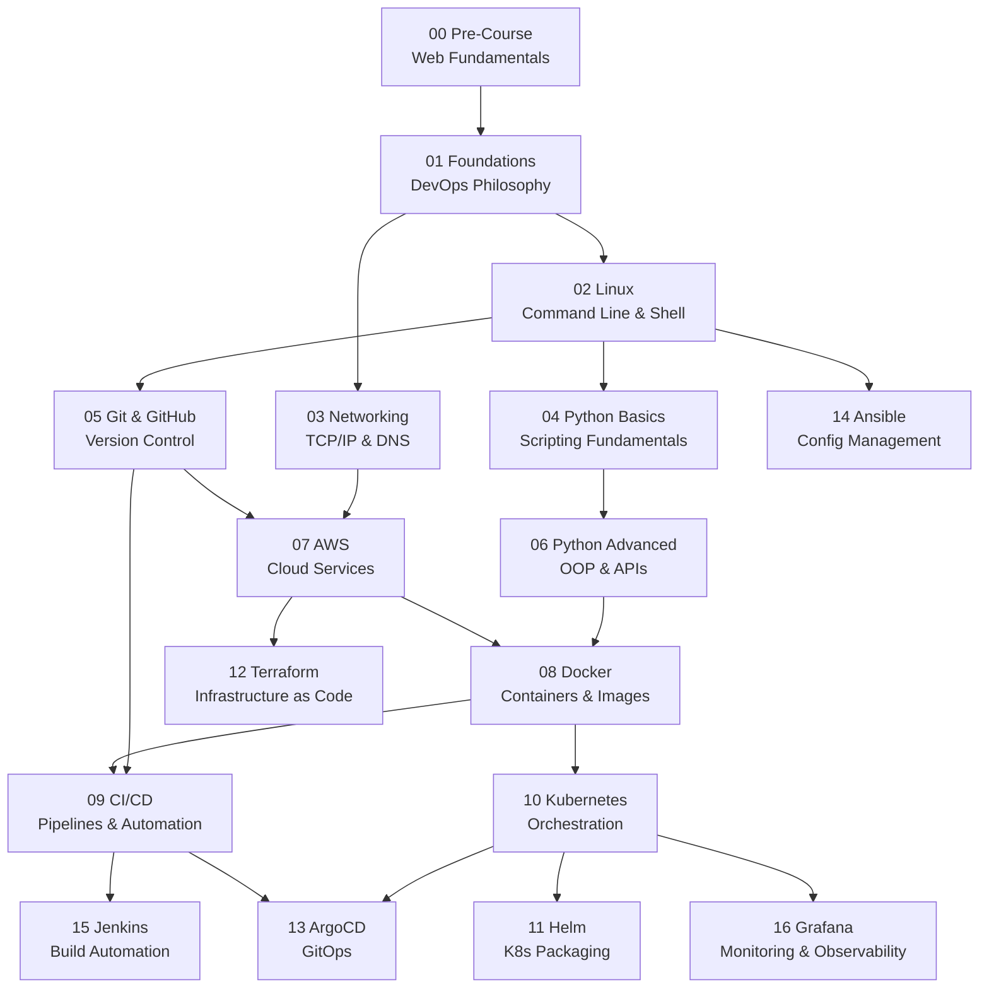

# Course Roadmap

## Reading the Map

- Arrows show prerequisites - follow them top to bottom
- Modules at the same level can be studied in parallel
- The core path runs through the center: 00 -> 01 -> 02 -> 04 -> 06 -> 08 -> 10
- Cloud (07, 12) and GitOps (13) branch off as specialized tracks
