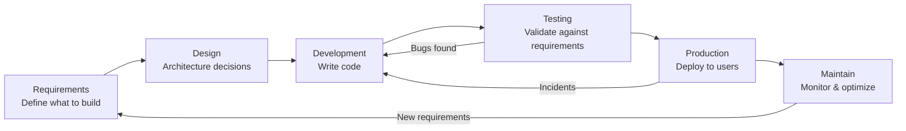

# SDLC Flow

## Key Points

- The cycle is continuous - maintenance generates new requirements
- Requirements errors propagate through every subsequent phase
- Testing validates against requirements, not against assumptions
- Maintenance is the longest phase - "the infinity stage"
- DevOps automates the path from Development through Production and Maintenance
