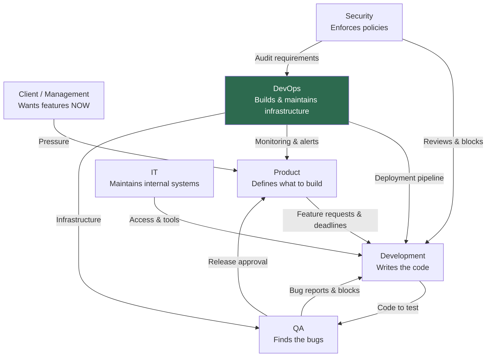

# Team Conflict Map

## Conflict Patterns

| Conflict | Root Cause |
|----------|-----------|
| Product vs Dev | Unrealistic timelines vs technical reality |
| Dev vs QA | "It works on my machine" vs "It fails in testing" |
| Everyone vs Security | Speed vs safety |
| Dev vs DevOps | "Just deploy it" vs "It is not production-ready" |

## The Alliance Rule

"The enemy of my enemy is my friend." - Teams align and realign based on who is applying pressure at any given moment.
