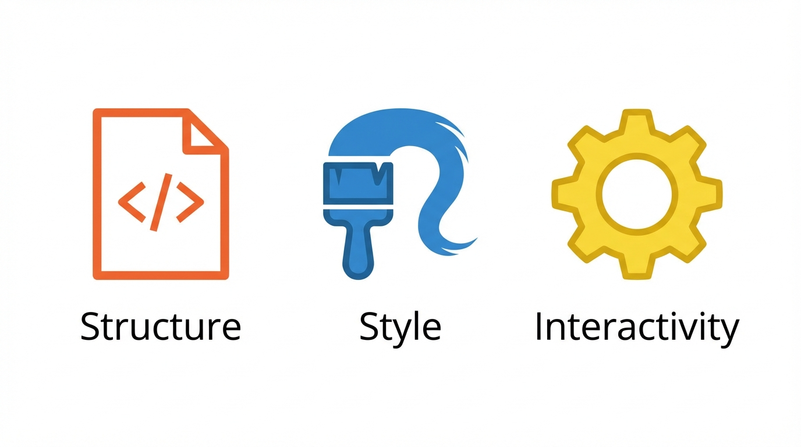
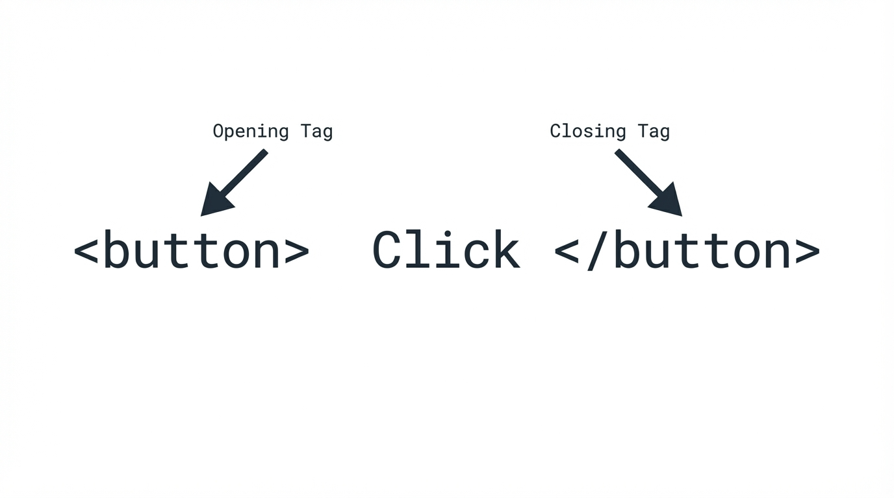

# DevOps Pre-Course - Self Learning Path

## Description

Structured self-learning documentation for DevOps course prerequisites covering HTML, CSS, and JavaScript fundamentals via SoloLearn.

This repository serves as a comprehensive knowledge base tracking my progress through the foundational web technologies required before starting the DevOps training program.

## Author

**David Rubin** - AI Solutions Specialist
GitHub: [@Dude775](https://github.com/Dude775)
Portfolio: [system-portfolio.vercel.app](https://system-portfolio.vercel.app)

---

## Learning Path

### 1. HTML - Complete ✅

**Course**: SoloLearn HTML
**Status**: Complete
**Current Progress**: 5/5 lessons completed (3 lessons + 1 booster + 1 lesson)

#### Lesson 1: The Core Web Technology



**Key Points:**
- HTML (HyperText Markup Language) is the standard markup language for creating web pages
- HTML describes the structure and content of a web page
- HTML consists of elements represented by tags
- Browsers interpret HTML to display formatted content
- HTML works alongside CSS (styling) and JavaScript (interactivity) as core web technologies

#### Lesson 2: HTML Code



**Key Points:**
- HTML documents have a defined structure with essential elements
- The `<!DOCTYPE html>` declaration defines the document type
- The `<html>` element is the root of an HTML page
- The `<head>` contains meta information about the document
- The `<body>` contains the visible page content
- HTML tags usually come in pairs: opening tag `<tag>` and closing tag `</tag>`

**Code Example:**
```html
<!DOCTYPE html>
<html>
<head>
    <title>My First Page</title>
</head>
<body>
    <h1>Welcome to HTML</h1>
    <p>This is my first HTML page.</p>
</body>
</html>
```

#### Lesson 3: Headings


**Key Points:**
- HTML provides six levels of headings: `<h1>` through `<h6>`
- `<h1>` is the most important (largest), `<h6>` is the least important (smallest)
- Use only one `<h1>` per page for proper document structure
- Follow correct heading hierarchy - don't skip levels (e.g., h1 → h2 → h3)
- Headings are container tags - they require both opening and closing tags
- Empty tags (like `<br>` and ``) don't have closing tags

#### Lesson 4: AI-Generated Practice


**Key Points:**
- Reviewed angle brackets (`< >`) as the fundamental HTML syntax
- Practiced paragraph tags `<p>` for text content
- Reinforced understanding of container tags (require closing tags) vs empty tags (no closing tag)
- The browser acts as an HTML translator - converting tags into visual elements
- HTML controls the structure of the page, defining what content appears and in what order

#### Lesson 5: Images


**Key Points:**
- The `` tag is an empty tag - no closing tag needed
- The `src` attribute points to the image URL or file path
- Image URLs must be enclosed in quotes: `src="image.jpg"`
- Broken image icon appears when the path is wrong or image can't be loaded
- Web servers store and serve images to browsers when requested

---

### 2. CSS - Not Started ⏳

**Course**: SoloLearn CSS
**Status**: Not Started
**Progress**: 0%

---

### 3. JavaScript - Not Started ⏳

**Course**: SoloLearn JavaScript
**Status**: Not Started
**Progress**: 0%

---

## Tech Context

These foundational web technologies are prerequisites for the DevOps training program. Understanding HTML, CSS, and JavaScript is essential for:

- Working with web-based DevOps tools and dashboards
- Creating custom monitoring and automation interfaces
- Understanding application structure for containerization
- Debugging web applications in CI/CD pipelines
- Implementing Infrastructure as Code with web-based consoles

---

## Certificates

Certificates will be added upon course completion:

- [ ] HTML Certificate
- [ ] CSS Certificate
- [ ] JavaScript Certificate

---

**Last Updated**: February 2026
