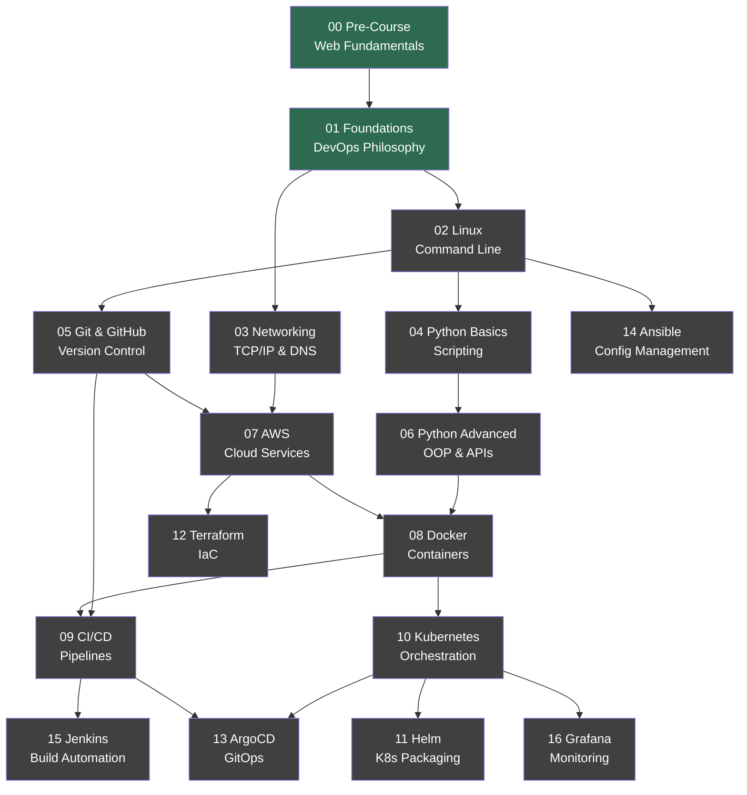

# Course Roadmap

## Visual Overview

Green = Complete | Gray = Upcoming

## Module Descriptions

| Module | What You Learn | Prerequisites |
|--------|---------------|---------------|
| **00 Pre-Course** | HTML, CSS, JavaScript basics via SoloLearn | None |
| **01 Foundations** | What DevOps actually is, SDLC, team dynamics, production mindset | 00 |
| **02 Linux** | Terminal, filesystem, permissions, shell scripting | 01 |
| **03 Networking** | TCP/IP stack, DNS, HTTP, ports, firewalls | 01 |
| **04 Python Basics** | Variables, loops, functions, file I/O, scripting | 02 |
| **05 Git & GitHub** | Branches, merges, PRs, collaboration workflows | 02 |
| **06 Python Advanced** | OOP, REST APIs, automation, testing | 04 |
| **07 AWS** | EC2, S3, VPC, IAM, core cloud patterns | 03, 05 |
| **08 Docker** | Images, containers, Compose, networking | 06, 07 |
| **09 CI/CD** | Pipeline design, GitHub Actions, deployment strategies | 05, 08 |
| **10 Kubernetes** | Pods, services, deployments, ConfigMaps | 08 |
| **11 Helm** | Charts, values, templating, releases | 10 |
| **12 Terraform** | Providers, resources, state, modules | 07 |
| **13 ArgoCD** | GitOps principles, app-of-apps, sync strategies | 09, 10 |
| **14 Ansible** | Inventory, playbooks, roles, idempotency | 02 |
| **15 Jenkins** | Jenkinsfile, agents, shared libraries | 09 |
| **16 Grafana** | Prometheus, dashboards, alerts, SLOs | 10 |

## Learning Path Tracks

**Core Path**: 00 -> 01 -> 02 -> 04 -> 05 -> 08 -> 09 -> 10

**Cloud Track**: 03 -> 07 -> 12

**GitOps Track**: 09 -> 13

**Monitoring Track**: 10 -> 16
